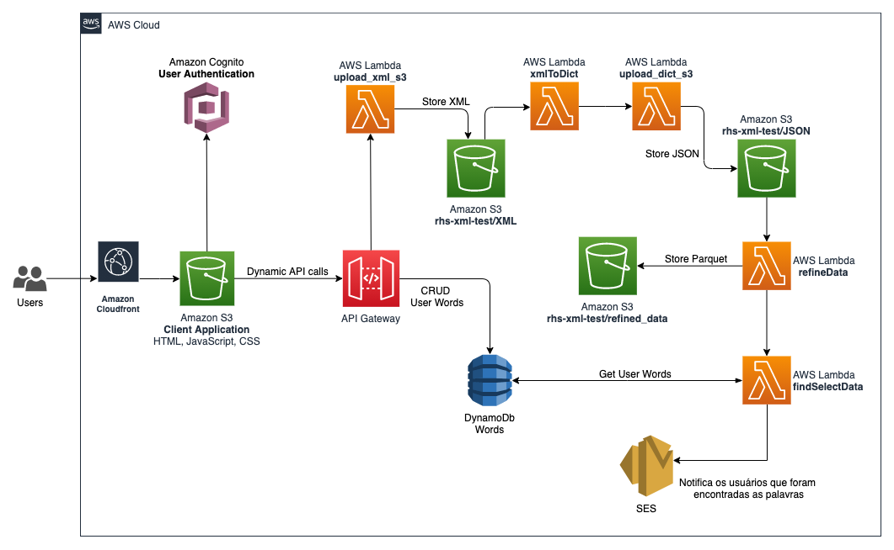

# Bid Machine

The Bid Machine application was designed to solve an internal demand from the sales team. The main purpose is to filter a XML file by specific words that are relevant to them. This can lead to find new business opportunites to AWS.

## The Challenge

- Create an UI/UX, User Interface/User Experience application, where the user can access and register the words that she/he wants to find when the email arrives.

- Create a data process pipeline to transform the XML into a Dataframe, make data analysis with it and notify the users when their specific words were found.
  

## Architecture Overview

 

